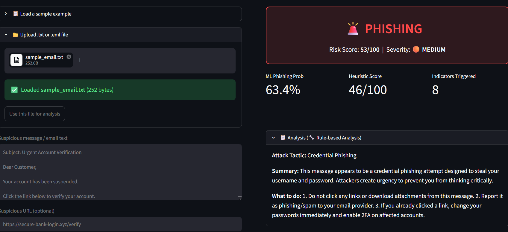
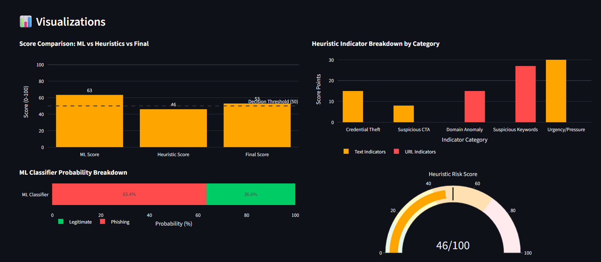
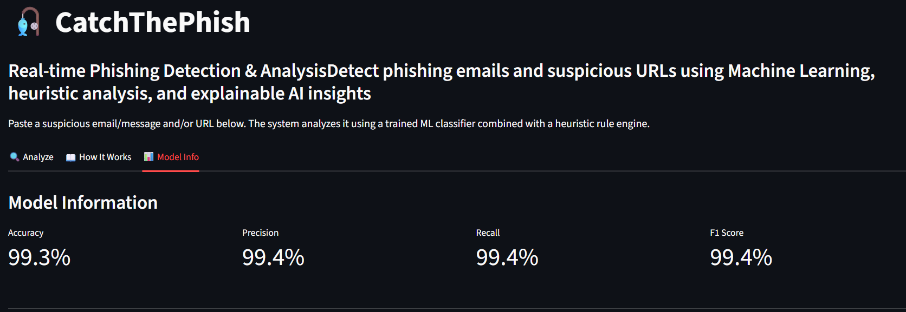

# 🎣 CatchThePhish

**An end-to-end phishing detection system combining Machine Learning, NLP, and heuristic-based URL analysis with an interactive Streamlit dashboard.**

CatchThePhish is a cybersecurity-focused project that detects phishing emails and suspicious URLs using a hybrid detection pipeline. It combines a TF-IDF + Random Forest classifier with a deterministic heuristic engine to provide accurate, explainable, and real-time phishing analysis.

---

## 🚀 Live Demo

**Streamlit App:** [](https://catchthephish-findthefakesbeforeyouclick-ctffyuikpv2gsfvtpvtdq.streamlit.app/)

---

## ✨ Features

* 🔍 Real-time phishing detection for emails and messages
* 🤖 Machine Learning classifier using TF-IDF + Random Forest
* 🌐 URL heuristic analysis with 15+ phishing detection rules
* ⚖️ Hybrid score fusion combining ML prediction and heuristic analysis
* 📊 Interactive dashboard with Plotly visualizations
* 📝 Explainable results showing triggered phishing indicators
* 🤖 Optional Google Gemini integration for human-readable security analysis
* 📂 Upload and analyze `.txt` and `.eml` email files
* 📈 Displays model metrics and evaluation statistics

---

## 🛠 Tech Stack

| Category           | Technologies                 |
| ------------------ | ---------------------------- |
| Language           | Python 3.10+                 |
| Machine Learning   | Scikit-learn (Random Forest) |
| NLP                | NLTK                         |
| Feature Extraction | TF-IDF                       |
| Web Framework      | Streamlit                    |
| Data Visualization | Plotly                       |
| AI Integration     | Google Gemini API (Optional) |

---

## 📊 Model Performance

| Metric           | Score      |
| ---------------- | ---------- |
| Accuracy         | **99.3%**  |
| F1 Score         | **99.4%**  |
| Training Samples | **31,323** |

*Evaluated on a held-out test set using Scikit-learn evaluation metrics.*

---

## 🧠 How It Works

```
Input (Email / Message / URL)
            │
            ▼
 ┌─────────────────────────┐
 │ NLP Preprocessing       │
 │ • Tokenization          │
 │ • Lemmatization         │
 │ • Stopword Removal      │
 └─────────────────────────┘
            │
            ▼
 ┌─────────────────────────┐
 │ TF-IDF Vectorization    │
 └─────────────────────────┘
            │
            ▼
 ┌─────────────────────────┐
 │ Random Forest Classifier│
 └─────────────────────────┘
            │
            ▼
 ML Phishing Probability
            │
            ├──────────────────────┐
            ▼                      ▼
                     Heuristic Rule Engine
               • URL Structure Analysis
               • Text Pattern Detection
               • Risk Scoring
            │
            ▼
      Hybrid Score Fusion
            │
            ▼
      Final Phishing Verdict
            │
            ▼
 Explainable Analysis + Visualizations
```

---

## 📂 Project Structure

```
CatchThePhish/
│
├── app.py
├── train_model.py
├── requirements.txt
├── README.md
├── .env.example
├── .gitignore
│
├── data/
│   ├── dataset.csv
│   └── sample_email.txt
│
├── models/
│   ├── rf_model.pkl
│   ├── tfidf_vectorizer.pkl
│   └── model_metrics.json
│
├── src/
│   ├── preprocessing.py
│   ├── predictor.py
│   ├── heuristic_engine.py
│   ├── email_parser.py
│   ├── llm_helper.py
│   ├── visualization.py
│   ├── utils.py
│   └── __init__.py
│
└── .streamlit/
    └── config.toml
```

---

## ⚙️ Installation

```bash
git clone https://github.com/yourusername/CatchThePhish.git

cd CatchThePhish

pip install -r requirements.txt

streamlit run app.py
```

The application will launch at:

```
http://localhost:8501
```

---

## 🔐 Optional Gemini AI Setup

Create a `.env` file using `.env.example` and add:

```
GEMINI_API_KEY=YOUR_API_KEY
```

Without an API key, the application automatically falls back to rule-based phishing explanations.

---

## 📸 Screenshots


### Detection Result



---

### Interactive Visualizations



---
### 📈 Model Performance



---

## 📈 Future Improvements

* Support attachment scanning
* Domain reputation lookup
* Browser extension integration
* Deep Learning / Transformer-based classifier
* Real-time threat intelligence APIs
* Explainable AI (XAI) feature importance visualization

---

## ⚠️ Limitations

* URL analysis is structural only and does not visit websites.
* Performance depends on training data quality.
* Rule-based heuristics may not detect highly sophisticated attacks.
* Intended for educational and demonstration purposes.

---

## 📄 License

This project is released under the MIT License.

---

## 👩‍💻 Author

**Ekta**

B.Tech CSE (Artificial Intelligence)

Indira Gandhi Delhi Technical University for Women (IGDTUW)


